# FIRST PROJECT

## SPLASH VIEW
 * [Splash](https://github.com/AlmuFerCar/First/blob/master/app/src/main/java/com/afernandezcar/first/Splash.java) init with image online


   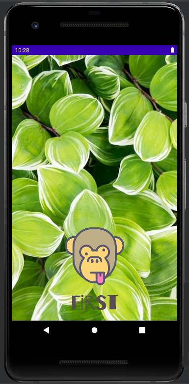


   If the internet image is not loaded, you see a background color that is predefined
      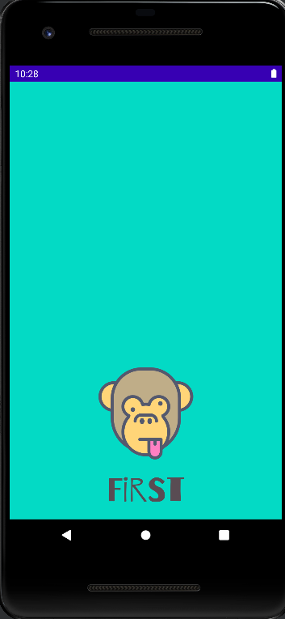


 * [Logo](https://github.com/AlmuFerCar/First/blob/master/app/src/main/res/anim/scale.xml) animation (zoom logo)


     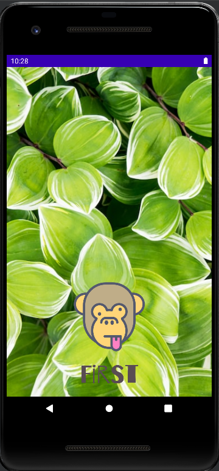

 * Logo [Splash](https://github.com/AlmuFerCar/First/blob/master/app/src/main/res/layout/activity_splash.xml) with name project
   
   
   * [Change font](https://github.com/AlmuFerCar/First/blob/master/app/src/main/res/font/barriecito.xml)


   * [Background gradient](https://github.com/AlmuFerCar/First/blob/master/app/src/main/res/drawable/gradient.xml) (the background is not visible because when starting the image or java background is loaded)


   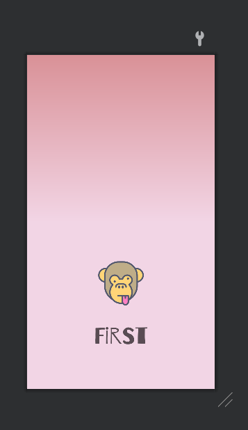


## LOGIN VERTICAL VIEW 
 * [Background_gradient](https://github.com/AlmuFerCar/First/blob/master/app/src/main/res/drawable/gradient.xml)


 * [Image face background](https://github.com/AlmuFerCar/First/blob/master/app/src/main/java/com/afernandezcar/first/LoginActivity.java)


 * Animation fade in


 * Animation zoom


 * Animation rotate 


   * [Animations](https://github.com/AlmuFerCar/First/blob/master/app/src/main/res/anim/fadein.xml) are done one after another in the same xml file


   * All animations are [implementates in this java file](https://github.com/AlmuFerCar/First/blob/master/app/src/main/java/com/afernandezcar/first/LoginActivity.java)
      
     
      ```Java
      ImageView thunder=findViewById(R.id.mono);
        Animation myanim = AnimationUtils.loadAnimation(this, R.anim.fadein);
        thunder.startAnimation(myanim);
      ```
     
   * [Transparent bottom](https://github.com/AlmuFerCar/First/blob/master/app/src/main/res/layout/activity_login.xml)


   * [guide lines](https://github.com/AlmuFerCar/First/blob/master/app/src/main/res/layout/activity_login.xml)


   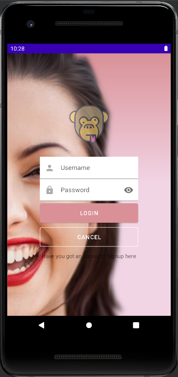  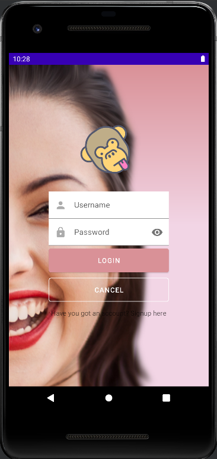  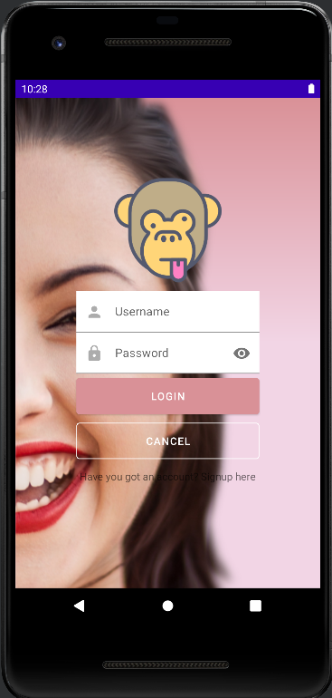  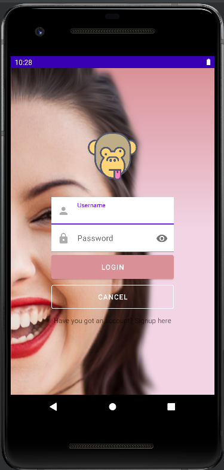


  #### LOGIN HORIZONTAL VIEW


* [Design rotate view](https://github.com/AlmuFerCar/First/blob/master/app/src/main/res/layout-land/activity_login.xml)


   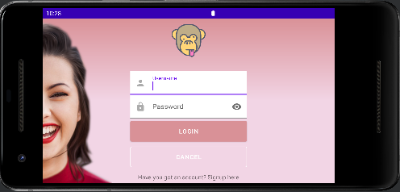


## SIGNUP VIEW


This view is similar to login view


* Icon in the edit text and password with eye icon [in this xml file](https://github.com/AlmuFerCar/First/blob/master/app/src/main/res/layout/activity_signup.xml)
   
  
   ```
    app:passwordToggleEnabled="true"
    app:startIconDrawable="@drawable/ic_lock"
   ```


   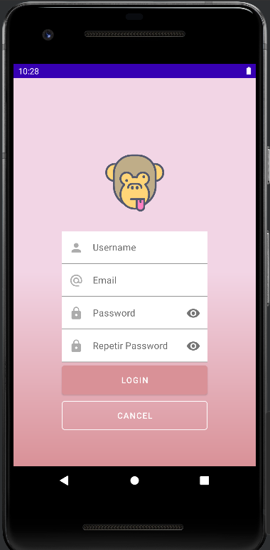


## MAIN VIEW


* [Main View Java](https://github.com/AlmuFerCar/First/blob/master/app/src/main/java/com/afernandezcar/first/Main.java)


* [Main View XML](https://github.com/AlmuFerCar/First/blob/master/app/src/main/res/layout/activity_main.xml) (WebView)


   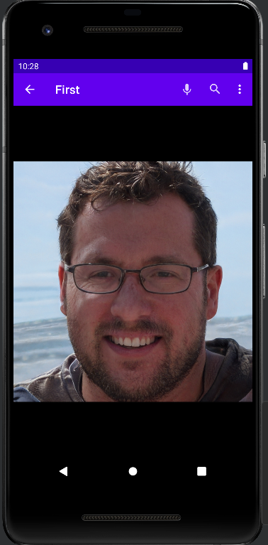


* Option select image


   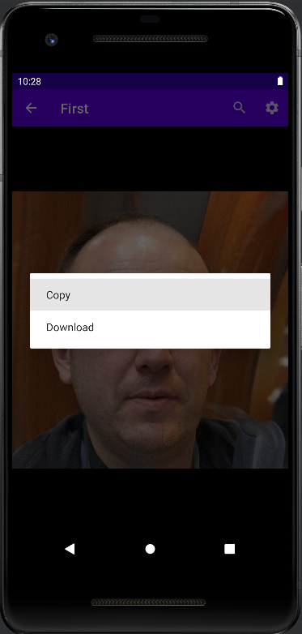


   * if you select copy


   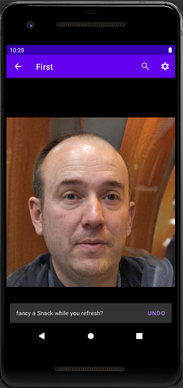


* option zoom image and image with zoom


   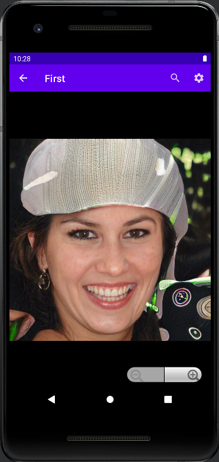 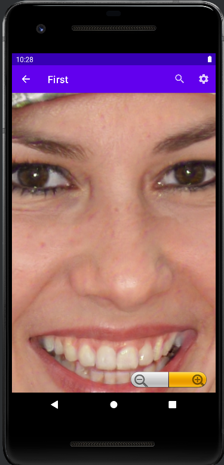


* App bar menu with back arrow  [Change file Manifest](https://github.com/AlmuFerCar/First/blob/master/app/src/main/AndroidManifest.xml)
   
  
   ```XML
    <activity
      android:name=".Main"
      android:exported="true"
      android:parentActivityName=".LoginActivity">
      <meta-data
      android:name="android.app.lib_name"
      android:value="" />
    </activity>
   ```


   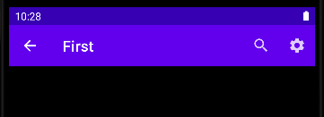


* Refresh Webview [in this Java file](https://github.com/AlmuFerCar/First/blob/master/app/src/main/java/com/afernandezcar/first/Main.java)


   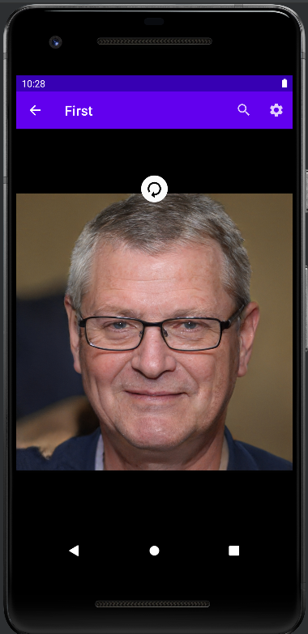


* Click search and settings icons [in this Java file](https://github.com/AlmuFerCar/First/blob/master/app/src/main/java/com/afernandezcar/first/Main.java) and design [in this XML file](https://github.com/AlmuFerCar/First/blob/master/app/src/main/res/menu/menu_appbar.xml)


    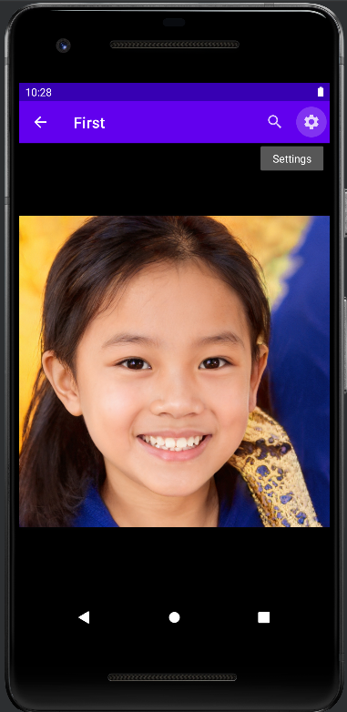


* Click on the settings button and display the menu with an option with an icon


   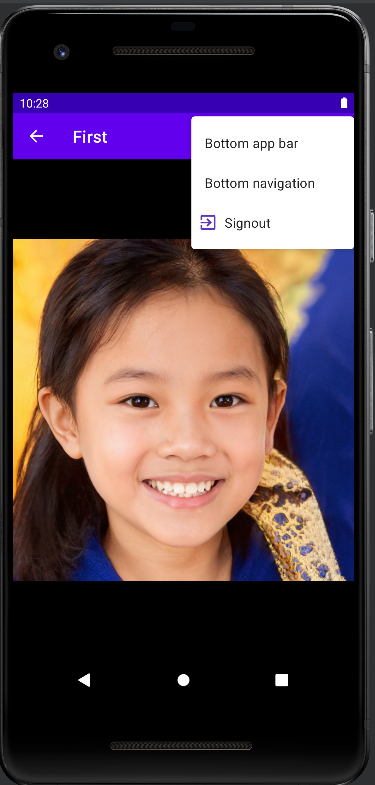


* Message click sign out with logo in the message


   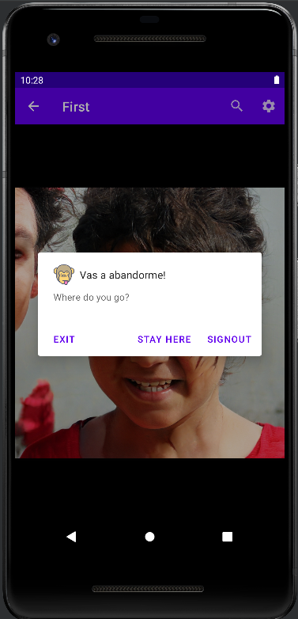


## In process...


* Customizing the dialog menu with my own [xml file](https://github.com/AlmuFerCar/First/blob/master/app/src/main/res/layout/alertdialog_view.xml) implements in [java file](https://github.com/AlmuFerCar/First/blob/master/app/src/main/java/com/afernandezcar/first/Main.java)


     ```Java
        builder.setView(getLayoutInflater().inflate(R.layout.alertdialog_view, null));
     ```


   


* Internationalization of the app:


  * Process: string file right click Open Translations Editor, choose language and translate


   


   


* Night mode:
  
  
  * Process: new values file select night mode and switch to the right, then add the colors with less lightness (lower the line)


   


   Night mode with Spanish language


## Other similar project ---> [Second](https://github.com/AlmuFerCar/Second.git)


## Content seen in class


| TEMAS                | CONTENIDOS                    |
|----------------------|-------------------------------|
| ESTILO               | themes, styles, colors, night |
| IMAGENES             | icons, glide,scrim            |
| MENUS                | context, appbar               |
| ACCION               | swipe, onclick                |
| COMPONENTES MATERIAL |                               |
| LAYOUTS              | constraint, landscape         |
| DIALOGS              |                               |
| ANIMACIONES          | constraint, landscape         |
| BUTTON SELECTOR      | checkbox                      |
| HANDLER              |                               |
| INTERNACIONALIZACION |                               |
| FONTS                |                               |


>This repository is licensed under
>[Creativecommons Org Licenses By Sa 4](http://creativecommons.org/licenses/by-sa/4.0/)