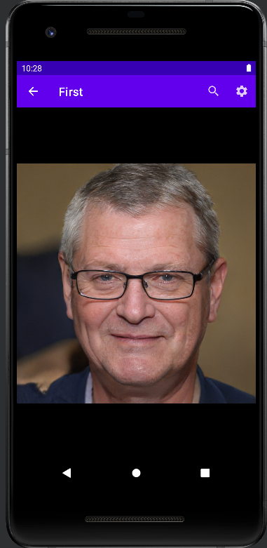
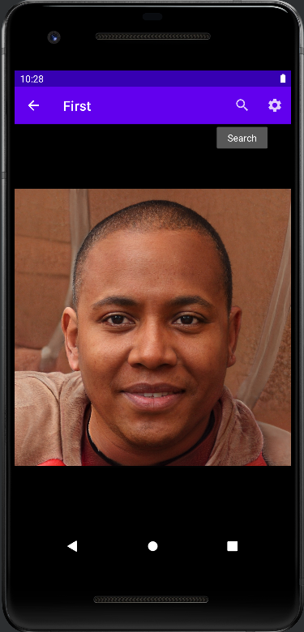

# FIRST PROJECT

## SPLASH VIEW
 * Splash init with image online [Splash_java](https://github.com/AlmuFerCar/First/blob/master/app/src/main/java/com/afernandezcar/first/Splash.java)


   


   If the internet image is not loaded, you see a background color that is predefined
      


 * Logo animation (zoom logo) [Logo_zoom](https://github.com/AlmuFerCar/First/blob/master/app/src/main/res/anim/scale.xml)


     

 * Logo splash with name project  [Splash_xml](https://github.com/AlmuFerCar/First/blob/master/app/src/main/res/layout/activity_splash.xml)
   
   
   * change font [Letra_Splash](https://github.com/AlmuFerCar/First/blob/master/app/src/main/res/font/barriecito.xml)


   * background gradient (the background is not visible because when starting the image or java background is loaded)[Gradiente_fondo_Splash](https://github.com/AlmuFerCar/First/blob/master/app/src/main/res/drawable/gradient.xml)

   


## LOGIN VERTICAL VIEW 
 * Background gradient [background_gradient](https://github.com/AlmuFerCar/First/blob/master/app/src/main/res/drawable/gradient.xml)


 * Image face [image_java_background](https://github.com/AlmuFerCar/First/blob/master/app/src/main/java/com/afernandezcar/first/LoginActivity.java)


 * Animation fade in


 * Animation zoom


 * Animation rotate 


   * Animations are done one after another in the same xml file [animation_logo](https://github.com/AlmuFerCar/First/blob/master/app/src/main/res/anim/fadein.xml)


   * All animations are implementates in this java file [implements_animation_java](https://github.com/AlmuFerCar/First/blob/master/app/src/main/java/com/afernandezcar/first/LoginActivity.java)


   * Transparent bottom [transparent_bottom](https://github.com/AlmuFerCar/First/blob/master/app/src/main/res/layout/activity_login.xml)


   * Guide lines [guide_lines](https://github.com/AlmuFerCar/First/blob/master/app/src/main/res/layout/activity_login.xml)


         

  #### LOGIN HORIZONTAL VIEW


* Design rotate view [rotate view xml](https://github.com/AlmuFerCar/First/blob/master/app/src/main/res/layout-land/activity_login.xml)


   


## SIGNUP VIEW


This view is similar to login view
* Icon in the edit text and password with eye icon  [sign up view xml](https://github.com/AlmuFerCar/First/blob/master/app/src/main/res/layout/activity_signup.xml)


```
    app:passwordToggleEnabled="true"
    app:startIconDrawable="@drawable/ic_lock"
```

   


## MAIN VIEW


* Main View java [main java](https://github.com/AlmuFerCar/First/blob/master/app/src/main/java/com/afernandezcar/first/Main.java)


* Main View xml (WebView) [main xml](https://github.com/AlmuFerCar/First/blob/master/app/src/main/res/layout/activity_main.xml)


   


*Option select image


   


   * if you select copy


   


* option zoom image and image with zoom


    


* App bar menu with back arrow


[change file Manifest](https://github.com/AlmuFerCar/First/blob/master/app/src/main/AndroidManifest.xml)        


```XML
    <activity
      android:name=".Main"
      android:exported="true"
      android:parentActivityName=".LoginActivity">
      <meta-data
      android:name="android.app.lib_name"
      android:value="" />
    </activity>
```


   


* Refresh Webview


[main java](https://github.com/AlmuFerCar/First/blob/master/app/src/main/java/com/afernandezcar/first/Main.java)


   


* Click search and settings icons


[main java](https://github.com/AlmuFerCar/First/blob/master/app/src/main/java/com/afernandezcar/first/Main.java)


[appbar menu](https://github.com/AlmuFerCar/First/blob/master/app/src/main/res/menu/menu_appbar.xml)


    


* Click on the settings button and display the menu with an option with an icon


   


* Message click sign out with logo in the message


   

 

|TITULO1 |TITULO2 |
|:-----:|:----:|
|       |      |
| CONTENIDO COLUMNA 1 | CONTENIDO COLUMNA 2 |


