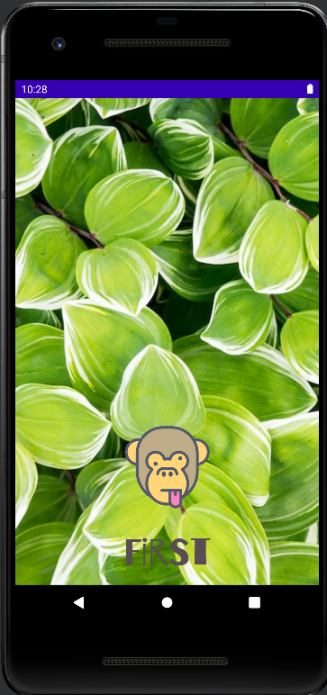

# FIRST PROJECT

## SPLASH VIEW
 * Splash init with image online [Splash_java](https://github.com/AlmuFerCar/First/blob/master/app/src/main/java/com/afernandezcar/first/Splash.java)

If the internet image is not loaded, you see a background color that is predefined

   

 * Logo animation (zoom logo) [Logo_zoom](https://github.com/AlmuFerCar/First/blob/master/app/src/main/res/anim/scale.xml)

     &rarr;  

 *Logo splash with name project  [Splash_xml](https://github.com/AlmuFerCar/First/blob/master/app/src/main/res/layout/activity_splash.xml)
    *change font [Letra_Splash](https://github.com/AlmuFerCar/First/blob/master/app/src/main/res/font/barriecito.xml)
    *background gradient (the background is not visible because when starting the image or java background is loaded)[Gradiente_fondo_Splash](https://github.com/AlmuFerCar/First/blob/master/app/src/main/res/drawable/gradient.xml)
   

   

## LOGIN VIEW

## SIGNUP VIEW

## MAIN VIEW

